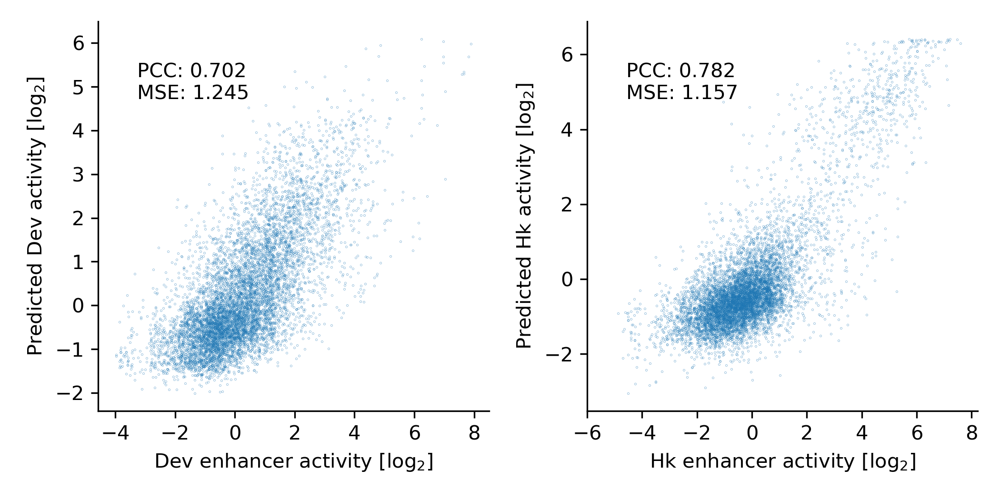

# SpliceBERT-analysis
Additional analysis on SpliceBERT. 
The original repository is available at [SpliceBERT](https://github.com/biomed-AI/SpliceBERT).


## Benchmark

### On SpliceAI's GTEx dataset

We fine-tuned SpliceBERT on SpliceAI's GTEx dataset with [R-Drop](https://proceedings.neurips.cc/paper/2021/hash/5a66b9200f29ac3fa0ae244cc2a51b39-Abstract.html) regularization for 5 times using different random seeds (model weights: [Google Drive](https://drive.google.com/file/d/1sUrsKbe0HJfLmNxqcNkmZccy835V0UFP/view?usp=sharing)). 
The average AP scores of SpliceBERT (900nt) is comparable (donor) or slightly superior (acceptor) to SpliceAI-10K, 
while the ensemble model (averaging the predictions of 5 models) underperforms that of SpliceAI-10K, 
which is likely because that SpliceBERT models were fine-tuned based on the same pre-trained model and thus lack sufficient diversity.

The source codes are available in [benchmark_spliceai-gtex](./benchmark_spliceai-gtex).

| model | receptive field size | AP (donor) | AP (acceptor) |  
| --- | --- | --- | ---- |  
SpliceBERT  | 900  | 0.8547 $\pm$ 0.0012  | 0.8458 $\pm$ 0.0009 |  
SpliceAI-10k  | 10001  | 0.8547 $\pm$ 0.0027  | 0.8434 $\pm$ 0.0023 |  
SpliceAI-2k  | 2001 | 0.8369 $\pm$ 0.0015  | 0.8270 $\pm$ 0.0017 |  
SpliceAI-400  | 401 | 0.7961 $\pm$ 0.0020  | 0.7873 $\pm$ 0.0026 |  
SpliceAI-80  | 81 | 0.5216 $\pm$ 0.0022  | 0.4449 $\pm$ 0.0020 |  


| model (ensemble) | receptive field size | AP (donor) | AP (acceptor) |  
| --- | --- | --- | ---- |  
SpliceAI-10k (ensemble)  | 10001  | 0.8735  | 0.8644 |  
SpliceBERT (ensemble)  | 900  | 0.8608  | 0.8524 |  


### On DeepSTARR's dataset

Though SpliceBERT was pre-trained on primary RNA sequences, it can also be applied to DNA sequences.
We finetuned SpliceBERT on DeepSTARR's dataset (https://zenodo.org/records/5502060) to identify sequences with potential enhancer activity. 
SpliceBERT outperformed DeepSTARR (convolution model) and Nucleotide Transformer (DNA language model).
The results are available at [benchmark_deepstarr](./benchmark_deepstarr).

| model | Developmental | Housekeeping |
| --- | --- | --- |  
SpliceBERT  | 0.70 | 0.78 |  
DeepSTARR | 0.68 | 0.74 |  
Nucleotide Transformer (multi-species) | 0.64 | 0.75 |  

 SpliceBERT_on_DeepSTARR (show 20% points) </img>


# Contact
For any questions, contact chenkenbio_[at]_gmail.com

# Citation

```TeX
@article{chen2024self_bbae163,
  title={Self-supervised learning on millions of primary RNA sequences from 72 vertebrates improves sequence-based RNA splicing prediction},
  author={Chen, Ken and Zhou, Yue and Ding, Maolin and Wang, Yu and Ren, Zhixiang and Yang, Yuedong},
  journal={Briefings in Bioinformatics},
  volume={25},
  number={3},
  pages={bbae163},
  year={2024},
  publisher={Oxford University Press}
}
```
